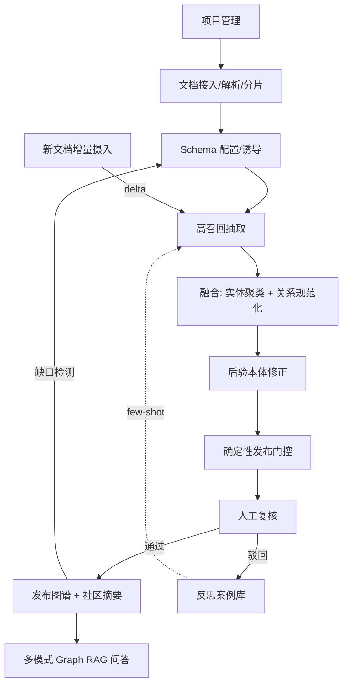

# KGExtraction 知识图谱抽取系统 — 产品设计文档（v3 演进版）

本文档在原有系统实现的基础上，结合 2026 年知识工程与 LLM 知识抽取领域的前沿研究（AutoSchemaKG、Wikontic、TRACE-KG、OntoKG、OAK+MEND、DIAL-KG、AEVS、Cognitive-Executive Separation 等）与活跃开源生态（LightRAG、Microsoft GraphRAG、OneKE、KGGen、OpenSPG/KAG、Cognee），对产品定位、功能架构与各功能点设计进行了重新设计与调整。

**v3 的核心增量**：引入 **「本体驱动的可编译抽取流程」**（详见 [第六章](#六schema-驱动的可编译抽取流程v3-核心设计)）。抽取流程不再是一条为所有本体写死的固定流水线，而是由 Schema **编译**出的、随本体形态而变的抽取计划（Plan）。这把产品从"知识图谱抽取工作台"升级为"把本体编译成抽取流程的引擎"，并同时解决两个长期矛盾：**抽取流程要足够灵活以适配从具体（人名、日期、文件名）到抽象（概念、规则、模式）的整条知识谱系**，而**用户交互入口又必须收敛**（不把技术旋钮怼给用户）。

文中以 **[现状]** 标记当前已实现能力，以 **[演进]** 标记 v2 引入的目标能力，以 **[v3]** 标记本次编译架构引入的设计，以便区分"代码事实"与"设计目标"。

---

## 一、产品概述与定位

### 1.1 产品定义

**KGExtraction** 是一款基于大语言模型（LLM）的 **可治理知识工程工作台**。其核心价值是：将非结构化文档（PDF、Word、Markdown、TXT）转化为 **结构化、可溯源、可校验、可增量演化** 的知识图谱，并支持基于图谱与原文的 **多模式溯源式问答**（Graph RAG）。

相较于"一把梭"的全自动 Schema-free 抽取系统，KGExtraction 选择 **Schema 引导 + 人工治理 + 确定性校验** 的中间路线：Schema 是一等公民，但支持数据驱动的诱导与版本化演化；每条知识锚定原文证据；发布前经过确定性门控。

### 1.2 产品定位

- **目标用户**：需要从内部文档/报告/规范中构建领域知识图谱，且对 **合规性、可解释性、可溯源性** 有强要求的团队（法务、研报、技术规范、企业知识库、科研）。
- **核心场景**：文档接入 → 定义/诱导本体（Schema）→ 高召回抽取 → 对齐融合与规范化 → 确定性校验 → 人工复核 → 发布 → 多模式 Graph RAG 问答 → 增量演化。
- **设计原则**：
  1. **Schema 可治理**：人工定义 + AI 诱导 + 版本化演化，而非完全抛弃或完全静态。
  2. **证据可溯源**：实体与关系锚定原文片段乃至原文短句（span/quote）。
  3. **结果可校验**：LLM 负责"提案"，确定性引擎负责"裁决"，避免用 LLM 检查 LLM。
  4. **图谱可演化**：新文档增量摄入与合并，而非全量重建。
  5. **检索可路由**：按查询复杂度在向量/子图/关联记忆/社区摘要间选择。
  6. **质量可度量**：内建 MINE / 抽取保真度评测闭环。
  7. **私有化友好**：文件系统 + SQLite + 本地向量库，无强依赖外部图数据库。
  8. **流程可编译 [v3]**：抽取流程由本体编译而来，一次规划、确定执行；计划本身可审查、可复现、可版本化——治理对象从"抽取结果"扩展到"抽取过程"。

- **定位升级 [v3]**：从"Schema 引导的可治理知识工程工作台"演进为 **「本体→抽取流程编译引擎」**。其锋利之处在于：面对"实体可以是任意抽象程度的东西"这一现实（同一本体里既有文件名/日期这类表面实体，也有需要从案例中归纳的规则/概念），固定流水线必然顾此失彼；而让本体编译出专用流程，才能既灵活又收敛。护城河不在"能抽图谱"（那是门槛），而在"抽出来的知识、以及抽取的过程本身，都可在合规场景里被交代和复现"。

### 1.3 核心特性摘要

| 特性 | 说明 | 状态 |
|------|------|------|
| 流程化工作台 | 项目 → 文档 → Schema → 抽取 → 融合校验 → 复核 → 发布 七阶段向导 | 现状(五步) + 演进(融合校验阶段) |
| 智能抽取引擎 | 分片并发、one-pass/multi-pass、实体消歧、跨片段关系、自我修正 | 现状 |
| 多阶段融合流水线 | 高召回候选 → 对齐/聚类 → Schema 校验 → 关系谓词规范化 | 演进 |
| 证据锚定 | 实体/关系附带原文短句证据，支撑溯源与审计 | 演进 |
| 确定性发布门控 | Schema/类型/约束规则校验，仅合规知识进入发布图 | 演进 |
| 后验本体修正 | 抽取后批量检测并修正本体违规（低 token 成本） | 演进 |
| Schema 智能建议与演化 | 文档分析、多轮对话生成、增量缺口诱导、版本化 | 现状(建议) + 演进(演化) |
| 智能模型路由 | 按任务复杂度选择轻量/均衡/强力模型 | 现状 |
| 多模式 Graph RAG | direct / 向量 / 子图 / PPR 关联 / 社区摘要 + 意图路由 | 现状(子图/向量) + 演进(PPR/社区/路由) |
| 增量图谱生命周期 | 新文档 delta 摄入与合并、可选软废弃 | 演进 |
| 反思案例库 | 人工复核修改沉淀为 few-shot，反哺抽取与修正 | 演进 |
| 评测闭环 | MINE-1 信息保留率、抽取 F1、RAG 效用基线 | 演进 |
| 冷启动支持 | 从已有图谱 JSON 导入并反推 Schema | 现状 |
| **本体驱动的可编译抽取流程** | Schema 编译为抽取计划（Plan）；步骤库 + 规划器 + 解释器；知识按"具体↔抽象"谱系分道抽取 | **v3** |
| **抽取计划治理** | Plan 可读、可编辑、可版本化、可复现；治理从"结果"扩展到"过程" | **v3** |
| **知识类型抽象度分道** | surface / normalized / inductive 三态，各走不同证据、消歧、校验子流程 | **v3** |

---

## 二、功能架构与模块划分

### 2.1 系统分层架构

```
┌─────────────────────────────────────────────────────────────────────┐
│                  前端 (React + Vite + Ant Design)                     │
│  WorkbenchPage (流程向导) │ GraphPage (可视化 + 多模式 Graph RAG)     │
└─────────────────────────────────────────────────────────────────────┘
                                    │ HTTP / REST / SSE
┌─────────────────────────────────────────────────────────────────────┐
│                      后端 (FastAPI + Pydantic)                        │
│  routers: system | projects | documents | schema | runs | graph |     │
│           graph_rag | (演进) fusion | validation | benchmark          │
└─────────────────────────────────────────────────────────────────────┘
                                    │
┌─────────────────────────────────────────────────────────────────────┐
│                       核心服务层 (services/)                          │
│  LLM 网关 │ 文档解析/分片 │ 抽取流水线 │ (演进) 融合与规范化 │         │
│  (演进) 确定性校验引擎 │ (演进) 后验修正 │ Schema 建议/演化 │          │
│  多模式 Graph RAG │ (演进) 评测引擎 │ (演进) 反思案例库               │
└─────────────────────────────────────────────────────────────────────┘
                                    │
┌─────────────────────────────────────────────────────────────────────┐
│                            存储层                                     │
│  文件系统 (data/projects/{id}/) │ SQLite (graph.db, chunk_store.db)   │
│  FAISS 向量索引 │ (演进) communities/ │ (演进) schema 版本快照        │
└─────────────────────────────────────────────────────────────────────┘
```

### 2.2 功能模块与职责

| 模块 | 职责 | 主要入口 | 状态 |
|------|------|----------|------|
| **项目管理** | 项目 CRUD、项目级数据目录 | `routers/projects.py` | 现状 |
| **文档管理** | 上传、解析、分片、向量索引、冷启动导入、(演进)增量摄入 | `routers/documents.py` | 现状 + 演进 |
| **Schema 配置** | 本体编辑、AI 建议、多轮对话、(演进)缺口诱导与版本化 | `routers/schema.py` + `schema_suggestion.py` | 现状 + 演进 |
| **抽取任务** | 启动/继续/重启、进度与日志 | `routers/runs.py` + `extraction/graph.py` | 现状 |
| **融合与规范化** | (演进)批次实体聚类、关系谓词规范化、多阶段精炼 | (演进) `services/fusion/` | 演进 |
| **校验引擎** | (演进)发布前确定性门控、后验本体修正 | (演进) `services/validation/` + `extraction/correction.py` | 现状(规则) + 演进(门控) |
| **图谱管理** | 草稿/发布图 CRUD、发布/驳回、导出、导入、(演进)增量合并 | `routers/graph.py` + `graph_store.py` | 现状 + 演进 |
| **Graph RAG** | 意图识别、实体匹配、子图扩展、(演进)PPR/社区/路由、流式问答 | `routers/graph_rag.py` + `graph_rag.py` | 现状 + 演进 |
| **评测** | (演进)MINE-1、抽取 F1、RAG 效用回归 | (演进) `scripts/benchmark_*.py` | 演进 |
| **反思案例库** | (演进)复核修改沉淀、few-shot 注入 | (演进) `services/reflection/` | 演进 |
| **系统配置** | API Key、模型、分片/向量/抽取/(演进)校验开关 | `routers/system.py` + `config.py` | 现状 + 演进 |

### 2.3 端到端流程（演进后）



---

## 三、各功能点实现方式

### 3.1 大模型调用（LLM Gateway）[现状]

**实现位置**：`backend/services/llm_gateway.py`

- **统一入口**：所有 LLM 调用经 `LLMGateway`，OpenAI 兼容接口（默认阿里云 DashScope `base_url`）。
- **模型路由**：按任务复杂度选择模型：
  - `simple`（如 qwen-turbo）：意图识别、查询实体抽取。
  - `normal`（如 qwen-plus）：实体/关系抽取、自我修正。
  - `complex`（如 qwen-max）：消歧、跨片段推断、Schema 建议、(演进)后验本体修正裁决。
- **接口形式**：`chat()`（可带 `response_format=json_object`）、`chat_stream()`（流式）、`chat_json()`（JSON 兜底解析）。
- **稳定性**：对 `RateLimitError`、`APITimeoutError` 等指数退避重试（默认最多 3 次）。
- **可观测性**：可选 `stream_log=True` 写入当前 Run 抽取日志。

> **[演进] 角色化模型配置**：参考 LightRAG 的 EXTRACT/QUERY/KEYWORDS/VLM 角色独立配置思路，将模型路由从"复杂度三档"扩展为"任务角色 + 复杂度"二维矩阵，使抽取、校验、问答、关键词提取可独立选模与调参。

### 3.2 文档解析与分片 [现状] + [演进]

**实现位置**：`backend/services/parser.py`、`backend/services/chunker.py`

**解析 [现状]**：支持 PDF（pypdf）、TXT、Markdown（markdown-it-py）、DOCX（python-docx）；入口 `parse_document(file_path, ext)` 返回纯文本。

**分片 [现状]**：入口 `chunk_text(text, method, chunk_size, chunk_overlap)`；策略 `fixed_length` / `recursive_character` / `paragraph`；输出写入 `chunks/{doc_id}_chunks.json` 与 SQLite `chunk_store.db`；可选后台向量化写入 FAISS `vector` 索引。

**文档级配置 [现状]**：每文档可配置 `target_entities` / `target_relations`，抽取时裁剪该文档使用的 Schema。

> **[演进] 复杂版面与表格解析**：参考 LightRAG 2026 集成的 MinerU/Docling 路径，对复杂 PDF 启用 layout-aware 解析与表格结构化，将表格转为可抽取的行/列实体与关系；保留 chunk 与原始版面位置（page/bbox）以增强证据锚定。

### 3.3 Schema 配置、智能建议与演化

**实现位置**：`backend/routers/schema.py`、`backend/services/schema_suggestion.py`、`backend/models/schema.py`

**数据模型 [现状]**：
- **EntityType**：name、definition、examples、color。
- **RelationType**：name、definition、source_entity_type、target_entity_type、examples。
- **SchemaConfig**：entity_types + relation_types，持久化在 `project_dir/schema.json`。

**智能建议流程 [现状]**：
1. **文档宏观分析**：均匀采样片段 → `DOC_PROFILING_PROMPT` 分析领域边界、结构化特征、实体/关系语义 → 保存 `schema_profile.md`。
2. **Schema 建议生成**：`SUGGEST_PROMPT` 基于分析报告 + 片段样本生成 JSON Schema（失败回退默认通用 Schema）。
3. **Schema 多轮对话**：`SCHEMA_CHAT_SYS_PROMPT` 以"支撑多跳推理与溯源"为目标，与用户讨论实体/关系类型。
4. **从对话生成 Schema**：`GENERATE_FROM_CHAT_PROMPT` 将对话规范化为 JSON Schema。

**冷启动 [现状]**：`extract_schema_from_graph_data()` 从已导入图谱统计类型并反推 Schema。

> **[演进] 内在-关系路由（Intrinsic-Relational Routing，对标 OntoKG）**：在 EntityType/RelationType 之外，引入"属性 vs 关系"的显式分流——可独立成为节点的概念走 RelationType（边），仅描述实体的字段走 EntityType 的属性 schema（写入 `Node.properties`）。避免把本应是属性的信息错误建模为关系，提升图谱紧凑度。

> **[演进] Schema 演化工作流（对标 TRACE-KG / DIAL-KG）**：新批次文档抽取后，对照现有 Schema 检测"未覆盖的高频实体/关系类型"（缺口检测）→ LLM 诱导候选新增类型 → 工作台 UI 人工确认 → 写入新版本 `schema.json` 并生成版本快照。Schema 由"一次性静态"升级为"可治理演化"。

> **[演进] 能力问题驱动（Competency Questions，对标 HyDRA）**：Schema 配置步骤可填写若干"该领域必须能回答的问题"，系统据此检验 Schema 覆盖度，作为 Schema 质量的人可理解的验收标准。

### 3.4 抽取流水线（核心工作流）[现状]

**实现位置**：`backend/services/extraction/graph.py`（编排）、`entity.py`、`relation.py`、`combined.py`、`correction.py`、`prompts.py`

**流程概览 [现状]**：
1. 加载 `schema.json` 与 `documents.json`（含每文档 target_entities/target_relations）。
2. 加载所有分片 `_load_all_chunks(project_dir)`。
3. 初始化实体向量索引 `entity`，写入已有草稿实体用于消歧。
4. 获取草稿实体表 `entity_map`（name → Node）。
5. 按分片并发执行（`asyncio.Semaphore` 限制并发）：
   - **按文档裁剪 Schema**：`_build_chunk_schema()`。
   - **抽取**：one-pass（`extract_entities_and_relations()`）或 multi-pass（先 `extract_entities()` 再 `extract_relations()`）。
   - **实体去重与消歧**：同名合并 chunk_id；开启 `enable_disambiguation` 时向量召回候选 + `disambiguate_entities()` LLM 判定。
   - **关系**：可选 `infer_cross_chunk_relations()`（confidence ≥ 0.7）。
   - **自我修正**：可选 `self_correct()`（规则 + LLM）。
   - **写边**：source/target 均在 `entity_map` 时建 Edge；缓冲达 `database_batch_size` 批量写草稿图。
6. 未命中实体的分片创建"未归类片段"节点；`_add_document_structure()` 建立"文档片段"锚点与"下一段"边。
7. 进度通过 `progress_callback` 回写 Run。

**任务生命周期 [现状]**：启动（独立 daemon 线程跑 `asyncio.run`）、继续（`skip_chunks` 断点续跑）、重启（清空草稿重跑）、日志（`logs/{run_id}.log`）。

> **[演进] 证据锚定抽取（Anchor-Constrained，对标 AEVS / Wikontic qualifier）**：抽取提示词增加"必须返回支撑该实体/关系的原文短句（evidence quote）"约束，限制 LLM 在原文范围内生成，降低幻觉。Node/Edge 新增 `evidence_quotes` 字段（见 3.10）。

> **[演进] 编排显式状态机**：当前编排为 asyncio 自研流水线（代码注释提及 LangGraph 但未实际使用）。演进目标是引入显式阶段状态机与检查点，使"抽取 → 融合 → 校验 → 发布"各阶段可暂停、可回放、可人工介入。

### 3.5 多阶段融合与规范化 [演进]

> 对标 Wikontic 多阶段流水线（MINE-1 86%）、KGGen 实体聚类、DIAL-KG 关系规范化（关系类型可减少约 15%）。

**实现位置（规划）**：`backend/services/fusion/`

**设计**：在抽取（高召回）与发布之间插入独立的融合阶段：

1. **Stage A — 高召回候选**：抽取阶段以召回优先，允许冗余实体/关系（可带 qualifier）。
2. **Stage B — 批次实体聚类**：Run 结束或按文档批次，对实体做 embedding 聚类（而非逐实体 LLM 消歧），对每个簇用一次 LLM 裁决合并代表名与别名，降低稀疏度与成本，作为现有实时消歧的补充或替代。
3. **Stage C — Schema 校验过滤**：剔除不符合 Schema 类型约束的实体与关系。
4. **Stage D — 关系谓词规范化（canonicalization）**：对语义近义的关系谓词（如"收购/被收购方/并购"）做 embedding 聚类 + LLM 裁决，归并为统一谓词，减少关系冗余。

**与现状关系**：现有 `entity.py` 的实时消歧保留为"在线模式"；融合阶段提供"离线批处理模式"，二者可按数据规模选择。

### 3.6 后验本体修正 [演进]

> 对标 OAK+MEND（2026-05）：先开放抽取，再批量修正本体违规，避免逐三元组多次 LLM 调用，显著降低 token。

**实现位置（规划）**：升级 `backend/services/extraction/correction.py`

**设计**：在现有 `_rule_based_correction` + `_llm_correction` 基础上，新增"批量后验修正"模式：
- 抽取/融合完成后，一次性收集所有疑似本体违规（类型不一致、source/target 类型与 RelationType 约束冲突、commonsense 矛盾）。
- 按违规类型分批，单次 LLM 调用修正一批，而非逐条调用。
- 修正结果写入草稿图，进入发布门控前由确定性引擎复核。

### 3.7 确定性发布门控 [演进]

> 对标 Cognitive-Executive Separation（CES）/ Licensing Oracle（SHACL）：LLM 提案、确定性引擎裁决，避免"用 LLM 检查 LLM"的递归信任问题。

**实现位置（规划）**：`backend/services/validation/`，接入 `publish_graph()` 路径

**设计**：发布（draft → published）前，由 **无推理能力的确定性引擎** 执行强制校验门控：
- **类型约束**：实体类型 ∈ Schema.entity_types；关系类型 ∈ Schema.relation_types。
- **源/目标约束**：边的 source/target 实体类型符合 RelationType 的 `source_entity_type` / `target_entity_type`。
- **完整性**：必填属性齐全；source_id/target_id 指向存在的节点。
- **证据约束 [演进]**：关键关系须具备至少一条 `evidence_quote`（可配置严格度）。
- **去重**：检测重复节点/边。

**裁决策略**：仅 **通过校验** 的知识进入 published；未通过的项保留在 draft 并在人工复核中高亮，附失败原因。LLM 的任何修正只写 draft，不能直接进入 published。这把"可信知识"的最终守门人交给确定性规则，而非 LLM。

### 3.8 实体消歧 [现状]

**实现位置**：`backend/services/extraction/entity.py`、`graph.py`

1. 新实体名 `embed_text()` 向量化，在实体索引 `search(top_k, score_threshold)` 召回候选。
2. 有候选则 `disambiguate_entities()`（`ENTITY_DISAMBIGUATION_*` 提示词）LLM 返回 `decisions`，`is_same=true` 则合并 chunk_id 到已有节点。
3. 关闭消歧时仅按名称精确去重。

> 配置项（`config.py`）：`enable_disambiguation`、`disambiguation_fast_path_score`、`disambiguation_candidate_limit_per_entity`、`disambiguation_low_confidence_only` 等已就绪。**[演进]** 该在线消歧与 3.5 的批次聚类融合互补。

### 3.9 自我修正 [现状]

**实现位置**：`backend/services/extraction/correction.py`

1. **规则校验** `_rule_based_correction()`：过滤无 name/type 实体、Schema 外类型、重复实体；过滤非法关系。
2. **LLM 校验** `_llm_correction()`：`SELF_CORRECTION_*` 提示词检查类型一致性、源/目标约束、重复矛盾、置信度。
3. **应用修正** `_apply_corrections()`：按 remove/modify 更新。

> **[演进]** 此处的规则校验是 3.7 确定性门控的雏形；演进方向是将规则校验提炼为独立、可复用、可配置的校验引擎，并在发布路径强制执行。

### 3.10 图谱存储、证据与发布

**实现位置**：`backend/services/graph_store.py`、`backend/routers/graph.py`、`backend/models/graph.py`

**数据模型 [现状]**：
```python
Node:  id, name, entity_type, properties, source_chunk_ids, confidence
Edge:  id, source_id, target_id, relation_type, properties, source_chunk_ids, confidence
GraphData: nodes, edges, version, status(draft/published), updated_at
```

**存储 [现状]**：SQLite `graph.db`，记录带 `status='draft'|'published'`；草稿由抽取流水线写入；发布 `publish_graph()` 复制 draft → published、版本递增、生成 `snapshots/v{N}.json`、同步已发布实体到 `entity.index`、清空 NetworkX 缓存；已发布图用 NetworkX 内存有向图供子图/路径查询。

**其他能力 [现状]**：子图查询、实体搜索、导出 JSON、冷启动导入。

> **[演进] 证据字段扩展**：Node/Edge 新增 `evidence_quotes: List[{chunk_id, quote, start?, end?}]`，记录支撑该知识的原文短句，供溯源问答、审计与发布门控使用。`status` 扩展 `deprecated`（软废弃），用于增量生命周期。

> **[演进] 增量合并**：`publish_graph()` 与抽取写入路径支持 delta merge——新文档抽取的实体先与已发布实体做匹配/聚类，再合并 chunk_id 与证据，而非新建重复节点（对标 GraphRAG `is_update_run` 与 LightRAG 增量 merge）。

> **[演进] 互操作导出**：除 JSON 外，支持导出 Neo4j（节点/边 + chunk 互索引，对标 llm-graph-builder）与 SPG 友好格式（对接 OpenSPG/KAG 生态）。

### 3.11 增量文档摄入与图谱生命周期 [演进]

> 对标 GraphRAG 2.x `is_update_run`、LightRAG 增量更新、DIAL-KG 软废弃、Cognee 增量 cognify。

**设计**：
- **Delta 检测**：新上传文档按内容哈希识别新增/变更，仅对新 chunk 抽取。
- **增量合并**：新抽取实体/关系与已发布图做匹配合并（复用 3.5 聚类逻辑），仅更新受影响子图，避免全量 restart。
- **软废弃**：当新证据与旧事实冲突时，旧边/节点置 `status=deprecated` 并保留证据，而非直接删除，保证可审计。
- **Schema 缺口回流**：增量批次触发 3.3 的 Schema 演化检测。

### 3.12 多模式 Graph RAG（问图）

**实现位置**：`backend/services/graph_rag.py`、`backend/routers/graph_rag.py`

**现有检索模式 [现状]**：
- **direct**：不检索，直接问。
- **graph_flow / graph_full / graph_path**：基于图的检索（种子实体向量召回 → BFS 子图扩展 → 关联 chunk）。
- **text_only**：仅分片向量检索。
- 图模式可叠加文本检索补足 chunk。

各模式有独立上下文预算（`_get_mode_profile`：entity_recall_top_k、max_edges_in_prompt、max_chunks_in_prompt 等）防止提示词过长。

**图模式流程 [现状]**（以 graph_flow 为例）：实体起点召回（向量 / LLM 抽取 + 图匹配）→ `expand_subgraph()` BFS 扩展 → 取 chunk 原文 → 构建 Prompt（三元组 + 原文 + 历史）→ `stream_chat_rag()` 流式回答（可发送 `__RECALL_START__...__RECALL_END__` 展示召回）。

**意图识别 [现状]**：`identify_intent_from_query()` 已实现（结合 Schema 输出 target_entities/target_types），但当前未强制接入主流程。

> **[演进] 查询路由**：依据 2026 GraphRAG-Bench 共识（无单一最优架构），按查询复杂度路由——
> - 单跳事实 → 向量 RAG（`text_only`）
> - 实体邻域/中等复杂 → 子图 BFS（`graph_flow`，加 PathRAG 式路径剪枝）
> - 多跳关联 → **新增 `hippo` 模式**：NetworkX 上 Personalized PageRank 种子激活排序（对标 HippoRAG，低成本多跳）
> - 全局/主题（"这份库讲了什么"）→ **新增 `global` 模式**：基于社区摘要（见下）
> 路由由 `identify_intent_from_query()` 的输出 + 查询特征驱动，正式接入主流程。

> **[演进] 社区摘要（对标 Microsoft GraphRAG）**：发布时对已发布图运行 Leiden 社区检测 + LLM 层级摘要，存 `communities/`，供 `global` 模式回答宏观主题类问题。

> **[演进] 证据增强回答**：回答引用具体 `evidence_quotes`，前端展示"结论 → 关系三元组 → 原文短句"的溯源链。

### 3.13 反思案例库 [演进]

> 对标 OneKE Reflection Agent + 错误案例库；Cognee `improve` 反馈写回。

**设计**：
- 人工复核（HumanReview）中对节点/边的删除、改类型、改方向等修改记录沉淀为 `reflection_cases.json`（错误模式 + 正确做法）。
- 下一次抽取/修正时，将相关案例作为 few-shot 注入 `extraction` / `correction` 提示词。
- 可周期性由 LLM 归纳错误模式（类型漂移、关系方向错误、过度抽取），形成项目级"抽取规约"。

### 3.14 评测闭环 [演进]

> 对标 MINE-1（Wikontic 86% / GraphRAG 48% / KGGen 44%）、LLM-KG-Bench 3.0 FactExtract、GraphRAG-Bench。

**实现位置（规划）**：`backend/scripts/benchmark_*.py`

- **`benchmark_mine1.py`**：对抽取结果计算单文档信息保留率，建立项目回归基线。
- **LLM-KG-Bench FactExtract**：测 Schema 约束下三元组抽取 F1。
- **RAG 效用**：可选 GraphRAG-Bench 子集评估各 `retrieval_mode` 的 QA 效果。
- **项目 Dashboard**：MINE 分数、实体/关系密度、消歧合并率、发布门控拒绝率、各 RAG 模式对比，纳入工作台可视化。

### 3.15 前端工作流与页面

**实现位置**：`frontend/src/App.tsx`、`pages/WorkbenchPage.tsx`、`pages/GraphPage.tsx`、各 `components/`

**工作台向导 [现状五步 + 演进]**：
1. **项目管理**（ProjectManager）[现状]
2. **文档上传**（DocumentUpload）[现状]：上传、解析/分片状态、冷启动导入；**[演进]** 增量摄入入口。
3. **Schema 配置**（SchemaEditor）[现状]：编辑、建议、对话、从对话生成；**[演进]** 缺口诱导、版本化、能力问题。
4. **智能抽取**（ExtractionRunner）[现状]：启动/继续/重启、进度、日志。
5. **融合与校验**（演进，新增步骤）：批次聚类、关系规范化、后验修正、发布门控结果与拒绝原因展示。
6. **人工复核**（HumanReview）[现状]：增删改节点/边、发布/驳回、导出/导入；**[演进]** 修改沉淀反思案例、证据溯源展示。

**图谱页 [现状 + 演进]**：Cytoscape.js 力导向图、按类型着色、框选/缩放/详情；Graph RAG 聊天区选择检索模式、流式回复、召回展示；**[演进]** 模式自动路由、证据溯源链、社区视图。

**系统配置**（SystemConfig）[现状 + 演进]：模型、分片、向量、抽取开关；**[演进]** 校验门控严格度、融合开关、角色化模型配置。

---

## 四、整体流程与数据流

### 4.1 端到端流程（演进后）

```
1. 创建/选择项目
2. 上传文档 → 解析 → 分片 → chunk_store →（可选）向量索引 ；（演进）增量 delta 检测
3. 配置 Schema：手动 / AI 建议 / 对话生成 ；（演进）缺口诱导 + 版本化 + 能力问题
4. 启动抽取 Run：分片并发高召回抽取 → 消歧 → 可选跨片段/自我修正 →（演进）证据锚定 → 写草稿图
5. （演进）融合：批次实体聚类 → Schema 校验过滤 → 关系谓词规范化 → 后验本体修正
6. （演进）确定性发布门控：类型/约束/证据/去重校验 → 仅合规知识候选发布
7. 人工复核草稿图 → 编辑（修改沉淀反思案例）→ 发布（或驳回）
8. （演进）发布：增量合并 + 版本快照 + Leiden 社区摘要
9. 多模式 Graph RAG 问答：意图路由 →（向量/子图/PPR/社区）检索 → 构建 Prompt → 流式回答 + 证据溯源
10. （演进）新文档增量摄入 → delta 合并 → Schema 缺口回流
11. （演进）评测：MINE-1 / 抽取 F1 / RAG 效用回归
```

### 4.2 数据流与存储汇总

| 数据 | 来源 | 存储位置 | 状态 |
|------|------|----------|------|
| 项目列表 | 用户创建 | `data/projects.json` | 现状 |
| 项目目录 | 创建项目 | `data/projects/{project_id}/` | 现状 |
| 文档元信息 | 上传解析 | `documents.json`、`documents/{id}.{ext}` | 现状 |
| 分片 | chunker | `chunks/{doc_id}_chunks.json`、`chunk_store.db` | 现状 |
| 分片向量 | 后台索引 | `vector.index` + `vector_meta.json` | 现状 |
| Schema | 编辑/建议 | `schema.json` | 现状 |
| Schema 版本快照 | 演化确认 | `schema_versions/v{N}.json` | 演进 |
| 文档分析报告 | Schema 建议 | `schema_profile.md` | 现状 |
| 草稿/发布图 | 抽取与发布 | `graph.db`（draft/published/deprecated） | 现状 + 演进 |
| 证据短句 | 抽取锚定 | Node/Edge.evidence_quotes（随图存储） | 演进 |
| 实体向量 | 抽取与发布 | `entity.index` + `entity_meta.json` | 现状 |
| 社区摘要 | 发布时 Leiden | `communities/` | 演进 |
| 快照 | 发布 | `snapshots/v{N}.json` | 现状 |
| Run 列表与状态 | 启动/进度 | `runs.json` | 现状 |
| Run 日志 | 抽取过程 | `logs/{run_id}.log` | 现状 |
| 反思案例 | 复核修改 | `reflection_cases.json` | 演进 |
| 评测结果 | benchmark | `benchmarks/{date}.json` | 演进 |
| 问图历史 | Graph RAG | `chat_history.json` | 现状 |
| 系统配置 | 界面/环境变量 | `data/system_config.json` | 现状 |

---

## 五、技术栈与部署

### 5.1 技术栈

| 层次 | 技术 | 状态 |
|------|------|------|
| 前端 | React 18、TypeScript、Vite、Ant Design、Cytoscape.js、Axios | 现状 |
| 后端 | FastAPI、Pydantic v2、异步路由 | 现状 |
| LLM | OpenAI SDK（AsyncOpenAI），兼容 DashScope；(演进)角色化配置 | 现状 + 演进 |
| 文档解析 | pypdf、python-docx、markdown-it-py；(演进)MinerU/Docling | 现状 + 演进 |
| 分片 | 自研 chunker（fixed_length / recursive_character / paragraph） | 现状 |
| 向量 | FAISS（IndexFlatIP）、sentence-transformers（bge-small-zh）、可选 API embedding | 现状 |
| 图存储与计算 | SQLite、NetworkX；(演进)Leiden 社区、PPR | 现状 + 演进 |
| 抽取编排 | 自研异步流水线（asyncio + Semaphore）；(演进)显式状态机/检查点 | 现状 + 演进 |
| 校验 | 规则校验；(演进)确定性发布门控引擎 | 现状 + 演进 |
| 评测 | (演进)MINE-1 / LLM-KG-Bench / GraphRAG-Bench | 演进 |
| 互操作 | JSON 导入导出；(演进)Neo4j / SPG / MCP | 现状 + 演进 |

### 5.2 部署 [现状]

- **本地**：`./startup.sh` 或分别启动 backend（`uvicorn main:app --port 8000`）与 frontend（`npm run dev`）。
- **Docker**：`docker-compose up -d`，前端 Nginx 静态资源，后端 8000；数据挂载 `backend/data`。
- **环境**：Python 3.9+、Node.js 18+；`.env` 配置 `DASHSCOPE_API_KEY`、`BASE_URL`。
- **扩展**：替换 `base_url` 与模型名对接其他 OpenAI 兼容服务；调整 `DATA_DIR` 适配持久化。

---

## 六、Schema 驱动的可编译抽取流程（v3 核心设计）

> 本章是 v3 的核心增量，定义"本体如何编译成抽取流程"的完整契约（数据结构与接口），不含具体实现，供团队评审与后续分阶段落地。

### 6.1 问题与动机

现状的抽取流水线（`services/extraction/graph.py`）是一条**为所有本体写死的固定流程**：分片 → LLM 抽实体+关系 → 逐字证据校验 → 名称消歧 → 类型校验 → 写图。它是围绕"命名实体"（人名、公司名）设计的，但真实的知识工程有两个它无法满足的诉求：

1. **知识是从具体到抽象的连续谱**。同一个本体里，实体既可能是**表面存在、可定位**的东西（文件名、日期、账号、人名），也可能是需要从案例中**归纳概括**出来的东西（概念、规则、行为模式）。例如从一段审计案例描述中抽象出一条精简规则——"客户账户短时间内集中转入、分散转出"。这条规则**原文里根本不存在**，是归纳的产物。

2. **不同抽象度的知识，需要结构不同的抽取流程，而不只是参数不同**。表面实体重在识别精度与表面对齐；归纳知识重在概括质量、粒度控制与语义去重。用一条固定流水线同时服务两者，必然顾此失彼。

固定流水线在归纳型知识上，几个核心机制不是不够、而是**反作用**：

| 机制 | 在命名实体上 | 在归纳知识（如规则）上 |
|------|--------------|------------------------|
| 证据逐字校验（`services/evidence.py`） | 有效：实体名逐字出现在原文 | **有害**：归纳出的规则不会逐字出现，会被全判 `verified=False`，门控还会拦掉 |
| 名称/向量消歧 | 有效：表面形式对齐 | **失效**：同义规则措辞不同、名称相似度低，去重不掉，规则库迅速膨胀 |
| LLM 自报置信度 | 勉强可用 | **无意义**：归纳任务的自报置信度无客观依据 |
| "正确性"定义 | 可定义：实体在不在文本、类型对不对 | **无法客观定义**：归纳粒度、概括忠实度是主观的 |

因此，"可治理"在归纳型知识语境下，重心必须从"判定对错"转向：**归纳链可追溯（挂靠源案例）、粒度可控、语义可归并、以及用下游判别力代替无法定义的正确性**。这要求抽取流程本身能针对不同知识类型"分道行驶"。

### 6.2 核心理念：编译式，而非即兴式

让大模型"规划专用抽取流程"有两条路，成败在此分野：

- **即兴式（陷阱）**：每处理一个片段，让 LLM 现场决定下一步怎么抽。灵活，但**不可复现、成本失控、无法调试、无法治理**——与"可治理"直接冲突。
- **编译式（本设计采用）**：在**配置阶段一次性**地，让大模型把 Schema **编译**成一份**确定的、可读的、可固化的抽取计划（Plan）**；批量抽取时由确定的解释器按 Plan 执行。

关键分水岭：**规划是一次性的、便宜的、产物可审查的；执行是批量的、确定的、可复现的。** 一旦二者分离，"灵活"与"可治理"不再互相拉扯——治理对象变成那份可审查的 Plan，而非每次运行的即兴决策。这也是"收敛入口"的实现方式：用户不配流程，只**描述本体意图**并**确认生成的计划**；散落的技术旋钮（chunk_size、消歧阈值、one-pass/multi-pass…）全部沉降进 Plan，由规划器按知识类型自动设定。

### 6.3 架构总览（编译器类比）

| 编译器 | 本系统 |
|--------|--------|
| 源代码 | 用户对本体的**意图描述**（自然语言 + Schema） |
| 编译器 | **规划器 Planner**：分析 Schema + 文档样本，产出 Plan |
| 可读中间表示（IR） | **抽取计划 Plan**——人可读、可编辑、可版本化 |
| 运行时 | **计划解释器 Interpreter**：按 Plan 的 DAG 确定执行 |
| 标准库 | **步骤库 Step Library**：封闭、正交、可组合的抽取原语 |

用户写"源码意图"，从不触碰"机器码"。下面五节分别定义五份契约。

### 6.4 契约 A：知识类型元描述（规划器的输入信号）

在现有 `EntityType`（`name/definition/examples/color`）之上，为每个类型补充**抽取语义**。这些字段**不需要用户手填**，由规划器从用户的自然语言描述中诱导——这是"收敛入口"的落点。

```jsonc
KnowledgeType {
  "name": "风控规则",
  "definition": "从案例中归纳出的、可判别的异常资金行为模式",
  // ↓ 规划信号：该类型在"具体↔抽象"谱系上的定位
  "abstractness": "inductive",   // surface | normalized | inductive
  //   surface    表面存在、可定位   → 人名 / 文件名 / 账号
  //   normalized 表面存在、需标准化 → 日期(→ISO) / 金额(→数值)
  //   inductive  原文不存在、需归纳 → 规则 / 概念 / 模式
  "evidence_mode": "span",       // verbatim(逐字命中) | span(锚定源案例区间) | none
  "identity_by": "semantic",     // name(表面名去重) | semantic(语义等价去重)
  "structure_template": {        // 仅 inductive：归纳产物的结构约束
    "fields": [
      { "key": "触发条件", "required": true,  "description": "可判别的量化条件，禁止空泛表述" },
      { "key": "行为模式", "required": false, "description": "" },
      { "key": "风险类别", "required": true,  "description": "取值须在 Schema 枚举内" }
    ]
  },
  "granularity_hint": "须可执行到量化阈值层级"  // inductive 的粒度约束
}
```

一个类型落在 `abstractness` 谱上的位置，基本决定了它该走哪条子流程。这是整个编译的**类型推断**基础。

### 6.5 契约 B：步骤库原语清单（封闭、正交、可组合）

规划器**只能从这张表里选择**原语，不能发明。每个原语是一个纯函数式步骤：`(知识集, 片段上下文) → 知识集`。

| 组 | 原语 | 职责 | 适用抽象度 | LLM |
|----|------|------|-----------|-----|
| **分片** | `segment` | 按策略切分（size/overlap 随类型定） | 全部 | 否 |
| | `select_scope` | 限定某类型仅在特定章节抽取 | 全部 | 可选 |
| **候选生成** | `extract_surface` | 单遍 NER，输出带逐字 span 的实体 | surface | 是 |
| | `normalize_value` | 值标准化（日期→ISO、金额→数值） | normalized | 可选 |
| | `induce_from_cases` | 从片段归纳抽象知识 + 结构字段 + 区间证据 | inductive | 是 |
| | `aggregate_then_induce` | 先跨片段聚合再归纳（需全局视野的概念） | inductive | 是 |
| **关系** | `extract_relations_intra` | 片段内关系抽取 | 全部 | 是 |
| | `infer_relations_cross` | 跨片段关系推断 | 全部 | 是 |
| | `link_to_existing` | 与存量图谱链接 | 全部 | 是 |
| **对齐精炼** | `resolve_surface` | 表面消歧（向量召回 + LLM 裁决） | surface | 是 |
| | `merge_semantic` | 语义归并（嵌入聚类 + LLM，措辞不同也能并） | inductive | 是 |
| | `canonicalize_predicate` | 关系谓词规范化 | 关系 | 是 |
| **校验组织** | `validate_type` | 类型 ∈ Schema（确定性） | 全部 | 否 |
| | `validate_structure` | 归纳产物是否具备可判别字段（挡空泛规则） | inductive | 否 |
| | `verify_evidence_verbatim` | 证据逐字命中原文 | surface | 否 |
| | `verify_faithfulness` | 归纳是否被源案例支撑（挡幻觉归纳） | inductive | 是 |
| | `build_hierarchy` | 按粒度分层（泛化 / 特化） | inductive | 是 |
| | `detect_conflict` | 矛盾 / 冗余 / 死规则检测 | 全部 | 可选 |

**关键分道**：`surface` 类型走 `extract_surface → resolve_surface → verify_evidence_verbatim`；`inductive` 类型走 `induce_from_cases → merge_semantic → validate_structure → verify_faithfulness`。v2 引入的逐字证据校验，在此被正确限定为仅作用于 surface，不再误伤归纳知识。

**置信度的客观锚**：`merge_semantic` 归并归纳知识时**累积所有源案例**——一条规则被越多独立案例、越多情境支撑，可信度越高。归纳知识的置信度由此从"LLM 自报"改为"**支撑案例数 + 案例多样性**"，是客观频次而非主观打分。

### 6.6 契约 C：抽取计划（Plan）数据结构

Plan 是步骤的**有向无环图（DAG）**，而非线性序列——不同抽象度的子流程可并行、最后汇合。

```jsonc
Plan {
  "plan_id": "string",
  "schema_version": 7,              // 绑定 Schema 版本 —— 可复现 / 可治理的锚
  "source": "planner-llm",          // planner-llm | human-edited
  "validated": true,                // 是否通过确定性 validator（见 6.7）
  "steps": [ Step, ... ]            // 拓扑序
}

Step {
  "step_id": "s3",
  "primitive": "induce_from_cases", // 必须 ∈ 步骤库（契约 B）
  "targets": ["风控规则"],           // 作用于哪些知识类型
  "params": { "chunk_size": 1200, "overlap": 200 },  // 沉降进来的旋钮，规划器设定
  "depends_on": ["s1"],             // DAG 依赖
  "reason": "风控规则为 inductive，需从完整案例归纳，故用大块分片并单独归纳"  // ★可治理关键
}
```

一个含"账户 / 日期 / 风控规则"的本体，编译出的 Plan 结构示意：

```
segment(规则,大块) ─┐                     segment(账户/日期,小块) ─┐
                    ▼                                             ▼
     induce_from_cases(规则)               extract_surface(账户,日期)
                    ▼                                             ▼
     validate_structure(规则)              normalize_value(日期)
                    ▼                             resolve_surface(账户)
     verify_faithfulness(规则)                        │
                    ▼                                 ▼
     merge_semantic(规则) ────────┬─────────  verify_evidence_verbatim(账户,日期)
                                  ▼
                   infer_relations_cross(规则—命中—账户)
                                  ▼
                          detect_conflict(全部)
```

两条子流程各按知识类型走不同原语，在关系推断处汇合。每个 `Step.reason` 让"为什么这么抽"落到字段级，是"治理过程"的具体载体。

### 6.7 契约 D：规划器（Planner）接口与不变量

```
plan(schema: Schema, doc_samples: Chunk[], user_intent: string) -> Plan
```

- **输入**：带类型元描述的 Schema、文档样本、用户意图描述。
- **输出**：Plan 草案（待人确认）。

三条硬性不变量，缺一则退回"即兴陷阱"：

1. **封闭性**：`step.primitive` 必须 ∈ 步骤库，否则编译失败。规划器只能**编排**，不能**发明**步骤。
2. **可校验**：输出必须通过一个**确定性 validator**——DAG 无环、依赖完整、**每个目标类型都被至少一个候选生成原语覆盖**、每个 surface 类型必带证据校验步、每个 inductive 类型必带结构校验步。
3. **可解释**：每个 Step 必须给出 `reason`。

规划便宜（一次调用）、一次性、产物固化——这是与"每片段即兴规划"在成本与可治理性上的分水岭。

### 6.8 契约 E：执行语义（解释器 Interpreter）

```
execute(plan: Plan, docs) -> DraftGraph
```

- 按 Plan 的 DAG 拓扑执行；每个原语是纯函数 `(知识集, 片段上下文) → 知识集`，状态在步骤间流转。
- **每步后可 checkpoint**——可暂停、可人工介入、可回放（即 v2 提出但未落地的"显式状态机 + 检查点"）。
- **可复现**：同 Plan + 同文档 + LLM `temperature=0` → 结果稳定。这是"治理过程"能成立的物理前提。

由此，v2 悬空的"显式状态机/检查点"演进目标，与 v3 的"Schema 编译流程"合为同一件事：**状态机的结构由 Plan 决定，Plan 由 Schema 编译。**

### 6.9 治理升级：从治理结果，到治理过程

v2 的治理对象是"抽取结果"（证据、门控、审计、复核）。v3 把治理对象扩展到**"抽取过程"本身**：

- **Plan 可审查**：合规/审计场景可回答"这条知识是通过什么流程抽出来的"——每步有 `reason`、整体绑定 Schema 版本。
- **Plan 可复现**：同 Plan 同输入结果稳定，抽取过程可被独立复核方重放。
- **Plan 可版本化**：Schema 演化 → 重新编译 → 新版 Plan，形成"本体—流程—结果"三者对齐的版本链。
- **分道治理**：表面知识靠"证据逐字锚定"治理，归纳知识靠"区间锚定 + 归纳忠实度 + 下游判别力"治理；`verify_faithfulness` 抓幻觉归纳，`validate_structure` 挡空泛规则，`detect_conflict` 查矛盾冗余。

**归纳知识的"正确性"最终以下游判别力间接定义**：用抽出的规则回测一批标注案例（风险 / 正常），以命中率与误报率度量——把"规则对不对"这个无法回答的问题，转化为"规则能否把风险案例与正常案例分开"这个可度量的问题（`services/downstream_feedback.py` 为其雏形）。

### 6.10 与现有实现的映射（复用关系）

本设计不是推倒重来，而是**把现有的直线拆成积木**。现有逻辑大部分可直接映射为步骤库原语：

| 现有实现 | 映射为原语 |
|----------|-----------|
| `extraction/entity.py::extract_entities` | `extract_surface` |
| `extraction/entity.py::disambiguate_entities` | `resolve_surface` |
| `fusion/entity_clustering.py` | `merge_semantic`（把"名称相似度"换成"语义嵌入 + 是否同一逻辑"裁决） |
| `fusion/relation_canonicalize.py` | `canonicalize_predicate` |
| `extraction/relation.py::infer_cross_chunk_relations` | `infer_relations_cross` |
| `extraction/post_correction.py` | `validate_type` / `validate_structure` |
| `services/evidence.py::verify_quote` | `verify_evidence_verbatim`（限定 surface） |
| `services/community.py` / `benchmark.py` | 组织与评测类步骤 |
| **需新建** | `induce_from_cases`、`aggregate_then_induce`、`verify_faithfulness`、`build_hierarchy`、`Planner`、`Interpreter`、Plan 数据模型 |

### 6.11 落地路径（风险后置、价值前置）

三步走，每步可独立交付价值：

1. **地基先立（零行为变更）**：固化 Plan 数据结构，把当前固定流水线"反编译"为一份写死的默认 Plan，由解释器读它执行——外部行为与现状完全一致，但架构已就位。此步即可开始把 `SystemConfig` 的散落旋钮迁移进 Plan，率先缓解"入口不收敛"。
2. **拆步骤库**：将 `process_chunk` 内的环节抽成契约 B 的原语（复用现有逻辑），解释器改为按 Plan 遍历原语；新增 `induce_from_cases` 等归纳原语，打通 inductive 分道。
3. **上规划器**：实现 Schema → Plan 的编译器 + 前端"计划确认"界面。至此"收敛入口"与"灵活流程"才真正兑现。

第 1 步风险最低、即可迁移旋钮；LLM 规划的不确定性被推迟到第 3 步，且始终有"人确认 Plan"兜底。

### 6.12 风险与边界

1. **规划器只能选步骤、不能发明步骤**——限定在封闭步骤库内，否则回到即兴陷阱。
2. **Plan 必须人可确认、可编辑**——LLM 编译可能不合理，人是最后一道闸。
3. **默认走简单路径**——纯 NER 本体应编译出单步 Plan，不为灵活性强行复杂化；复杂步骤按知识类型按需启用。
4. **可复现是硬约束**——同 Plan + 同文档结果稳定，随机性受控（`temperature=0`），否则"治理过程"不成立。

---

## 七、演进路线图

| 阶段 | 目标 | 关键交付 |
|------|------|----------|
| **Phase 1 可信度底座（P0）** | 对齐 2026 可治理中间路线最低要求 | 证据锚定字段与 prompt、确定性发布门控、后验本体修正、关系谓词规范化、Graph RAG 意图路由、反思案例库 |
| **Phase 2 质量与生命周期（P0–P1）** | 提升抽取保真度与可维护性 | Wikontic 式多阶段精炼、KGGen 式批次实体聚类、增量文档摄入 + delta merge、HippoRAG PPR 模式、MINE-1 + FactExtract 回归 |
| **Phase 3 架构扩展（P1–P2）** | 形成完整知识工程工作台 | Schema 演化工作流、内在-关系路由、Leiden 社区摘要 + global 问答、可选事件双轨抽取、MinerU/Docling 解析、Neo4j/SPG 导出 |
| **Phase 4 生态与前沿（长期）** | 对接生态与探索 | TRACE-KG 条件关系 qualifier、DIAL-KG Meta-KB 与软废弃、Cognee MCP 集成、AutoGraph-R1 下游效用反馈 |
| **Phase 5 可编译抽取流程（v3，P0–P1）** | 从固定流水线升级为本体编译引擎 | ① Plan 数据结构 + 把现流水线反编译为默认 Plan（零行为变更、迁移旋钮）② 步骤库拆分 + 新增归纳类原语（`induce_from_cases`/`verify_faithfulness`）③ 规划器 + 前端"计划确认"入口；知识按 surface/normalized/inductive 分道 |

> Phase 5 与第六章对应。落地遵循"风险后置、价值前置"：第 ① 步不改变外部行为即可立起架构、开始收敛入口；LLM 规划的不确定性推迟到第 ③ 步，并始终以"人确认 Plan"兜底。

---

## 八、产品设计反推与演进总结

- **产品目标**：降低从非结构化文档到"可查询、可溯源、可校验、可演化"知识图谱的门槛，并支持多跳推理与问答。
- **关键设计**：
  - 用 **Schema（本体）** 约束抽取类型，并支持 **数据驱动诱导与版本化演化**（融合 OntoKG/TRACE-KG 思路）。
  - 用 **文档分析 + 多轮对话 + 缺口诱导** 降低 Schema 设计与维护成本。
  - 用 **高召回抽取 + 批次聚类 + 关系规范化 + 后验修正** 在质量与成本间取得平衡（融合 Wikontic/KGGen/OAK+MEND）。
  - 用 **证据锚定 + 确定性发布门控** 保证可溯源与可信（融合 AEVS/CES）。
  - 用 **草稿/发布分离 + 人工复核 + 反思案例库** 保证可干预与持续改进（融合 OneKE）。
  - 用 **增量摄入 + 软废弃** 支撑图谱生命周期（融合 GraphRAG/LightRAG/DIAL-KG）。
  - 用 **多模式 Graph RAG + 意图路由** 兼顾不同查询复杂度（融合 GraphRAG-Bench/HippoRAG）。
  - 用 **MINE + LLM-KG-Bench** 建立质量度量闭环。
  - **[v3]** 用 **本体编译（Schema → Plan → 确定执行）** 让抽取流程随知识抽象度分道，既灵活又收敛，并把治理从"结果"扩展到"过程"。
- **战略定位**：不与全自动 Schema-free 系统正面竞争。v2 定位为 **「Schema 引导的可治理知识工程工作台」**；v3 进一步升级为 **「本体→抽取流程编译引擎」**——面对"实体从具体到抽象的整条谱系"，以可编译、可复现、可治理的抽取计划作为核心壁垒，服务于法务、研报、审计、规范、科研等 **强合规、强溯源、且含抽象知识归纳** 的场景。

以上构成 KGExtraction 演进后的完整产品说明与设计文档，可用于产品评审、开发对接与后续分阶段实现。
